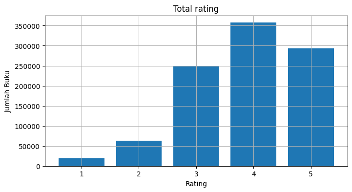
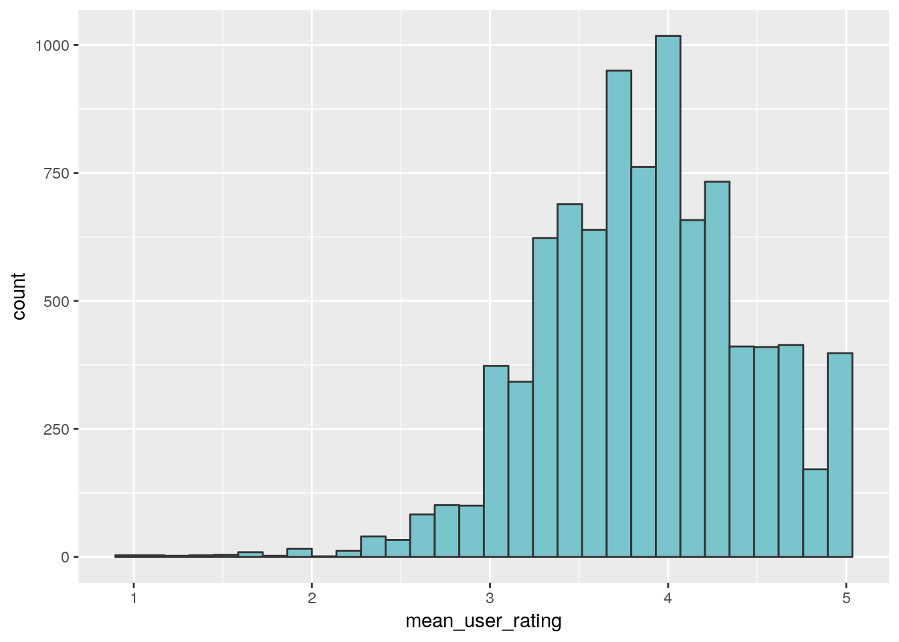
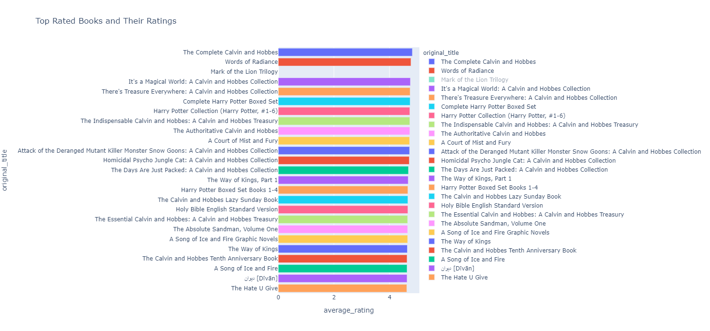
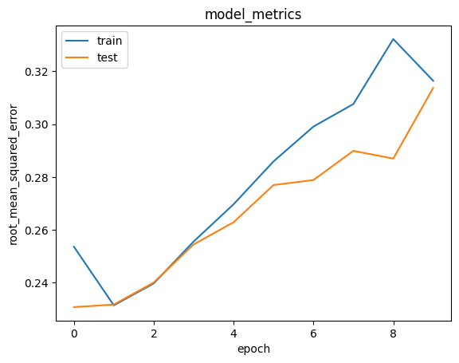

# Laporan Proyek Machine Learning - Sri Kresna Maha Dewa
## Project Overview

Membaca buku tetap menjadi salah satu cara paling efektif bagi individu untuk memperluas pengetahuan dan wawasan mereka terhadap berbagai topik[2]. Meskipun kita hidup dalam era di mana informasi mudah diakses melalui internet, minat baca di Indonesia masih rendah, mungkin karena banyaknya pilihan buku yang membuat pembaca kesulitan menemukan yang sesuai dengan preferensi mereka[4].

Dalam upaya meningkatkan minat baca masyarakat, proyek ini bertujuan untuk mengembangkan sistem rekomendasi buku yang lebih canggih. Metode utama yang akan digunakan adalah _Collaborative Filtering_, sebuah pendekatan yang mengintegrasikan sumber daya dan penelitian terkini dalam pengembangan sistem rekomendasi[2].

Melalui pendekatan ini, diharapkan pembaca dapat dengan mudah menemukan buku yang sesuai dengan kriteria dan preferensi mereka. Sistem akan menggunakan data kolaboratif dari sejumlah besar pembaca untuk merekomendasikan buku yang mungkin belum dikenal tetapi sesuai dengan selera mereka.

Melalui proyek ini, diharapkan masyarakat akan lebih tertarik untuk menjelajahi berbagai jenis buku, mendorong minat baca secara keseluruhan. Dengan menghadirkan rekomendasi buku yang personal dan akurat, proyek ini bertujuan tidak hanya memenuhi kebutuhan pembaca saat ini tetapi juga membuka jendela baru ke dunia literasi yang lebih luas.

Pendekatan ini diperkuat melalui integrasi sumber daya dan temuan penelitian terkini. Studi-studi terbaru dalam dunia literasi dan tren bacaan dapat menjadi landasan bagi proyek ini. Penelitian-penelitian tersebut dapat mencakup pemahaman terkini tentang preferensi pembaca, perkembangan tren literasi, dan dampak teknologi terhadap kebiasaan membaca. Dengan mengintegrasikan sumber daya ini, diharapkan proyek ini dapat menghasilkan rekomendasi yang tidak hanya relevan secara personal tetapi juga mengikuti perkembangan dan kebutuhan literasi masyarakat modern.

## Business Understanding

Penelitian ini bertujuan menyusun sistem rekomendasi buku yang secara tepat memenuhi kriteria dan preferensi setiap pembaca. Dengan menerapkan metode _collaborative filtering_, sistem ini dirancang untuk memberikan rekomendasi yang sangat personal dan relevan. Data pembaca, termasuk preferensi, kriteria, dan histori bacaan, akan dianalisis untuk memahami dengan lebih baik pola bacaan dan keinginan pembaca. Dengan memadukan pendekatan _user-based_ dan _item-based_, serta memasukkan elemen _context-aware_, diharapkan sistem ini mampu menghasilkan rekomendasi buku yang tidak hanya sesuai dengan selera pembaca, tetapi juga mempertimbangkan konteks spesifik, seperti waktu dan lokasi.

Melalui pengembangan sistem rekomendasi ini, diharapkan dapat meningkatkan minat baca masyarakat. Dengan memberikan rekomendasi yang akurat dan relevan, diharapkan pembaca akan lebih terlibat dalam eksplorasi literatur, memperluas wawasan mereka, dan pada akhirnya, mendorong peningkatan minat baca di kalangan masyarakat.

**Analisis Dampak Potensial Sistem Rekomendasi Buku terhadap Budaya Membaca Masyarakat**
- Personalisasi dan Relevansi:
Dampak Positif: Sistem rekomendasi yang memahami secara mendalam preferensi dan keinginan pembaca akan meningkatkan pengalaman membaca personal. Pembaca akan lebih mungkin menemukan buku-buku yang sesuai dengan minat mereka, meningkatkan kepuasan dan keterlibatan dalam proses membaca.

- Analisis Pola Bacaan dan Preferensi:
Dampak Positif: Melalui analisis data pembaca, sistem dapat membaca pola bacaan dan preferensi, menghasilkan rekomendasi yang lebih akurat. Ini tidak hanya meningkatkan kemungkinan pembaca menemukan buku yang mereka sukai, tetapi juga membantu mereka menjelajahi genre atau penulis baru yang mungkin sebelumnya tidak terpikirkan.

- Eksplorasi Literatur yang Lebih Luas:
Dampak Positif: Pembaca yang menerima rekomendasi yang tepat cenderung lebih terbuka untuk mengeksplorasi buku-buku baru. Hal ini dapat memperluas wawasan pembaca, membuka pintu untuk genre atau penulis yang sebelumnya kurang diakses, dan pada akhirnya meningkatkan budaya membaca yang inklusif.

### Problem Statements

- Bagaimana fitur yang dapat digunakan untuk membuat sistem rekomendasi?
- Bagaimana membuat sistem rekomendasi buku yang mungkin akan disukai berdasarkan _rating_ menggunakan _collaborative filtering_?

### Goals

1. Memberikan sejumlah rekomendasi buku yang belum dibaca atau mungkin akan disukai oleh pembaca dengan menggunakan _collaborative filtering_.
   - Memberikan setidaknya 10 rekomendasi buku yang belum dibaca atau yang mungkin disukai oleh pembaca
2. Membuat sebuah model yang memiliki kehandalan yang cukup agar rekomendasi bisa lebih akurat
   - Tingkat akurasi prediksi berdasarkan evaluasi RMSE mendekati angka nol untuk kategori baik.
   - Memastikan model dapat menangani variasi dalam preferensi pembaca dengan konsisten.

### Solution statements
- Implementasi _Collaborative Filtering_: Penerapan metode _collaborative filtering_ akan dilakukan melalui penggunaan kelas `RecommenderNet`. Ini bertujuan membentuk model yang handal dan _robust_, memungkinkan sistem memahami preferensi pembaca dengan lebih baik melalui informasi dari pengguna lain.

- Model Evaluation menggunakan RMSE: Kualitas model yang dibangun akan dievaluasi dengan menggunakan metode _Root Mean Square Error_ (RMSE). Pendekatan ini akan memberikan gambaran yang akurat tentang sejauh mana perbedaan antara prediksi model dengan nilai aktual, mengukur tingkat ketepatan dan kehandalan rekomendasi yang diberikan.

- Fokus pada Kualitas dan Akurasi: Selain pembangunan model yang powerful, penelitian ini menempatkan penekanan pada evaluasi kritis dengan menggunakan RMSE. Hal ini bertujuan untuk memastikan bahwa sistem rekomendasi buku tidak hanya mampu memberikan rekomendasi personal, tetapi juga secara konsisten akurat dan dapat diandalkan dalam memenuhi preferensi pembaca.

## Data Understanding
Dataset yang digunakan diambil dari situs **Kaggle** yang berjudul [_"goodbooks-10k"_](https://www.kaggle.com/datasets/zygmunt/goodbooks-10k?select=books.csv). Goodsreads adalah situs pembaca dan rekomendasi buku terbesar di dunia. Dataset ini berisi 5 file dengan ekstensi csv, yaitu:
1. **'book_tags.csv'**, file ini berisi data tag buku (label), diurutkan berdasarkan ascending goodreadsbookid dan count descending.
   - goodreads_id : ID dari goodreads
   - tag_id : ID tag (genre)
   - count : Jumlah goodreads

2. **'books.csv'**, berisi informasi mengenai buku.
   - id : ID dari file books
   - book_id : ID buku
   - best_book_id : ID dari buku populer
   - work_id : ID karya
   - books_count : jumlah edisi buku tertentu
   - isbn : nomor isbn
   - authors : nama penulis
   - original_publication_year : tahun terbit buku
   - original_title : judul asli buku
   
   Perbedaan antara ID Buku dan ID Buku Populer (Best Book ID):
   - book_id: Merupakan ID unik untuk setiap buku dalam dataset.
   - best_book_id: Merupakan ID buku yang dianggap sebagai buku populer atau buku terbaik. Ini mencerminkan edisi atau versi tertentu dari buku yang lebih banyak digunakan atau diakui oleh pengguna.

4. **'ratings.csv'**, berisi rating buku sesuai id pengguna.
   - book_id : ID buku
   - user_id : ID Pengguna
   - rating : rating buku

5. **'tag.csv'**, berisi tentang pemetaan id-nama tag.
   - tag_id : ID tag (genre)
   - tag_name : Nama tag (genre)

6. **'to_read.csv'**, daftar buku yang ditandai oleh pengguna "untuk dibaca". Diurutkan berdasarkan user_id dan book_id.
   - user_id : ID pengguna/pembaca
   - book_id : ID buku
   
    Dari data didapatkan Jumlah User = 48871.

**Exploratory Data Analysis (EDA)**:
Bagaimana pendapat pembaca atau rating yang diberikan kepada buku-buku yang ada di dataset? Berikut adalah grafiknya

> Gambar 1. Distribusi rating

Setiap individu memiliki kecenderungan berbeda dalam memberikan rating pada buku. Beberapa memberikan rating tinggi secara umum, bahkan untuk buku yang biasa-biasa saja, sementara yang lain lebih kritis dan memberikan rating maksimum hanya untuk buku yang dianggap sempurna. Pada grafik rata-rata rating, terlihat bahwa ada lonjakan pengguna dengan rata-rata rating 5, menandakan bahwa mereka cenderung memberikan rating tinggi pada semua buku yang mereka baca.

> Gambar 2. Rata-rata distribusi rating

Buku apa yang memiliki rating yang cukup bagus dalam dataset?

> Gambar 3. Buku dengan rata-rata rating terbaik

Bagaimana dengan buku yang memiliki rating terbanyak?
.png)
> Gambar 4. Buku dengan jumlah rating terbanyak

Dari semua buku, kapan buku-buku tersebut diterbitkan?
.png)
> Gambar 5. Jumlah buku berdasarkan tahun publikasi

Dari banyaknya buku yang ada, siapa penulis dengan jumlah buku paling banyak?
.png)
> Gambar 6. Data author beserta jumlah publikasinya

**Penggunaan Atribut untuk Pemodelan:**
File yang dapat digunakan untuk pemodelan adalah file 'books.csv' dan 'ratings.csv' dengan menggunakan variabel **'user_id', 'book_id', 'authors', 'original_title'** dengan model _collaborative filtering_. 
- user_id dan book_id: Untuk mengidentifikasi hubungan antara pengguna dan buku.
- authors dan original_title: Informasi tentang buku yang akan digunakan dalam pembuatan rekomendasi.

## Data Preparation
Teknik yang digunakan untuk data preparation antara lain sebagai berikut:
1. **Mengatasi Missing Value**, Data yang hilang dapat menyebabkan ketidakakuratan dan ketidakseimbangan dalam model. Oleh karena itu, penting untuk menangani nilai yang hilang agar model dapat memberikan hasil yang dapat diandalkan.

2. **Encoding Data**, melakukan penyandian (_encoding_) fitur **'user_id'** dan **book_id** ke bentuk indeks integer agar dapat diinterpretasikan oleh algoritma machine learning.

3. **Membagi Dataset**, dataset akan dibagi menjadi data train dan data test dengan rasio 80:20. Namun sebelum itu dilakukan pengacakan dataset agar distribusinya random/acak. Teknik _Encoding_ Data dan Membagi Dataset dilakukan untuk nantinya dipakai pada model _collaborative filtering_. Rasio 80:20 umumnya digunakan untuk memberikan data yang cukup untuk melatih model dan sekaligus menguji kinerjanya.

## Modeling

_Collaborative filtering_ bergantung pada pendapat komunitas pengguna. Ia tidak memerlukan atribut untuk setiap itemnya seperti pada sistem berbasis konten. Model ini memprediksi kegunaan item berdasarkan penilaian pengguna sebelumnya, misalnya cara pemberian _rating_ terhadap suatu item. Metode ini merekomendasikan item-item yang dipilih oleh pengguna lain dengan kemiripan model item dari pengguna saat ini.

Pada tahap ini, model akan menghitung skor kecocokan antara pembaca(_user_) dan buku menggunakan tekenik _embedding_. Langkah yang pertama adalah melakukan proses _embedding_ terhadap data pembaca(_user_) dan buku. Kemudian lakukan perkalian dot antara _embedding_ pembaca dan buku. Tambahkan bias untuk setiap pembaca dan buku. Fungsi sigmoid digunakan untuk menetapkan skor kecocokan dalam skala [0,1]. Langkah-langkah yang disebutkan diatas akan dimasukkan ke dalam sebuah class dari Keras bernama `RecommenderNet()`.

Kelebihan:
- Rekomendasi yang dihasilkan cenderung sangat _personalized_ karena didasarkan pada preferensi pengguna secara individu.
- Tidak perlu informasi rinci tentang setiap item karena mengandalkan pola perilaku pengguna.

Kekurangan:
- Cold-start problem: Algoritma menghadapi kesulitan dalam memberikan rekomendasi untuk pengguna atau item baru yang belum memiliki informasi preferensi terdokumentasi.
- Sparse problem: Keterbatasan dalam keakuratan algoritma dapat muncul ketika terdapat matriks _rating_ pengguna-item yang bersifat _sparse_, yaitu ketika terdapat banyak nilai kosong atau jarang diisi, mempengaruhi kemampuan model untuk memberikan rekomendasi yang tepat.

**Top N Rekomendasi**
Berikut adalah contoh hasil rekomendasi top 10 buku dari model untuk user dengan ID `15304`
| No  | Judul Buku                                                        | Author                              |
|-----|-------------------------------------------------------------------|-------------------------------------|
| 1   | A Briefer History of Time                                         | Stephen Hawking, Leonard Mlodinow   |
| 2   | The Jane Austen Book Club                                         | Karen Joy Fowler                    |
| 3   | A Room with a View                                                | E.M. Forster                        |
| 4   | Moo, Baa, La La La!                                               | Sandra Boynton                      |
| 5   | Raise High the Roof Beam, Carpenters & Seymour: An Introduction   | J.D. Salinger                       |
| 6   | The Innocent Man: Murder and Injustice in a Small Town            | John Grisham                        |
| 7   | Bleachers                                                         | John Grisham                        |
| 8   | Predator (Kay Scarpetta, #14)                                     | Patricia Cornwell                   |
| 9   | Another Roadside Attraction                                       | Tom Robbins                         |
| 10  | Women in Love (Brangwen Family, #2)                               | D.H. Lawrence                       |

> Table 1. Top N Rekomendasi

## Evaluation

Metrik evaluasi yang digunakan pada proyek ini adalah _Root Mean Square Error_.

_**Root Mean Squared Error**_

Metrik RMSE _(Root Mean Square Error)_ digunakan pada penelitian ini untuk mengevaluasi kinerja model yang dihasilkan. RMSE merupakan cara standar untuk mengukur kesalahan model dalam memprediksi data kuantitatif. _Root Mean Squared Error_ (RMSE) mengevaluasi model regresi linear dengan mengukur tingkat akurasi hasil perkiraan suatu model. RMSE dihitung dengan mengkuadratkan error (prediksi – observasi) dibagi dengan jumlah data (= rata-rata), lalu diakarkan. Perhitungan RMSE ditunjukkan pada rumus berikut.

$$RMSE = \sqrt{\Sigma_{i=1}^{n}{\frac{(ŷ_i - y_i)^{2}}{n}}}$$

Keterangan: 

RMSE = nilai _root mean square error_

y = nilai hasil observasi

ŷ = nilai hasil prediksi

i = urutan data

n = jumlah data

Nilai RMSE rendah menunjukkan bahwa variasi nilai yang dihasilkan oleh suatu model prakiraan mendekati variasi nilai obeservasinya. RMSE menghitung seberapa bedanya seperangkat nilai. Semakin kecil nilai RMSE, semakin dekat nilai yang diprediksi dan diamati. 

Visulaisasi evaluasi metrik menggunakan RMSE setelah pelatihan untuk model Collaborative filtering dapat dilihat pada Gambar 2.

> Gambar 7. Visualisasi Hasil RMSE

Dalam konteks evaluasi sistem rekomendasi, nilai _Root Mean Squared Error_ (RMSE) digunakan sebagai metrik utama. Berikut adalah interpretasi umum terhadap nilai RMSE:

- RMSE = 0:
   - Model memberikan prediksi yang sempurna dan tidak ada kesalahan prediksi. Namun, ini sangat jarang terjadi dalam praktik.
- 0 < RMSE < 0.3:
   - Model memiliki kinerja yang sangat baik. Prediksi sangat dekat dengan nilai observasi, dan kesalahan prediksi sangat kecil.
- 0.3 ≤ RMSE < 0.5:
   - Model memiliki kinerja yang baik. Prediksi memiliki tingkat akurasi yang tinggi, meskipun ada beberapa variasi antara nilai prediksi dan observasi.
- 0.5 ≤ RMSE < 1:
   - Model memberikan prediksi yang dapat diterima dengan tingkat akurasi yang moderat. Meskipun ada variasi, prediksi masih memberikan informasi yang berguna.
- RMSE ≥ 1:
   - Model memiliki kinerja yang kurang memuaskan. Kesalahan prediksi relatif besar dan dapat mempengaruhi nilai kegunaan sistem rekomendasi.

Nilai RMSE sebesar  0.3164 dan validasi error sebesar 0.3137. Dengan mengacu pada interpretasi di atas, sistem rekomendasi dapat dianggap baik karena nilai RMSE berada dalam rentang 0.3 hingga 0.5. Ini menunjukkan bahwa prediksi sistem memiliki tingkat akurasi yang tinggi dan dekat dengan nilai observasi. Meskipun ada beberapa variasi, sistem tetap memberikan rekomendasi yang baik kepada pengguna. 

## Kesimpulan
- Model _collaborative filtering_ dievaluasi menggunakan metode _Root Mean Square Error_ (RMSE) untuk mengukur sejauh mana perbedaan antara prediksi model dengan nilai aktual. Nilai RMSE yang dihasilkan sebesar 0.3137 mencerminkan tingkat akurasi model dalam memberikan rekomendasi. Semakin rendah nilai RMSE, semakin baik kinerja model dalam memprediksi preferensi pengguna.

- Dengan nilai RMSE yang relatif rendah, dapat disimpulkan bahwa model _collaborative filtering_ ini memiliki tingkat ketepatan yang baik dalam memprediksi kecocokan antara pembaca (_user_) dan buku. Hal ini menunjukkan bahwa rekomendasi yang dihasilkan oleh model cenderung mendekati preferensi sebenarnya dari pengguna.
Potensial untuk Peningkatan:

- Meskipun nilai RMSE yang diperoleh sudah menggambarkan kualitas model yang baik, terdapat potensi untuk melakukan peningkatan lebih lanjut. Pengoptimalan _parameter_, penambahan fitur, atau eksplorasi model yang lebih kompleks dapat menjadi langkah-langkah selanjutnya untuk meningkatkan kinerja model dan memberikan rekomendasi yang lebih presisi.

- Kesimpulan dari evaluasi ini menekankan pentingnya evaluasi terus-menerus terhadap model rekomendasi. Seiring perubahan preferensi pengguna dan pertumbuhan data, model perlu terus diperbarui dan disesuaikan untuk menjaga tingkat akurasi dan keandalan rekomendasi.

- Sebelum menarik kesimpulan final, perlu juga mempertimbangkan relevansi nilai RMSE dengan konteks aplikasi dan kebutuhan pengguna. Sebuah nilai RMSE yang rendah mungkin tidak selalu menjamin kepuasan pengguna, sehingga pemahaman mendalam terhadap kebutuhan pengguna sangat penting dalam mengevaluasi kualitas rekomendasi.

## Referensi
1. Alkaff, M., Khatimi, H., & Eriadi, A. (2020). Sistem Rekomendasi Buku pada Perpustakaan Daerah Provinsi Kalimantan Selatan Menggunakan Metode Content-Based Filtering. MATRIK: Jurnal Manajemen, Teknik Informatika Dan Rekayasa Komputer, 20(1), 193-202.
2. Irfan, M., & Cahyani, A. D. (2014). Sistem Rekomendasi: Buku Online Dengan Metode Collaborative Filtering. Jurnal Teknologi Technoscientia, 076-84.
3. ZAYYAD, M. R. A. (2021). Sistem Rekomendasi Buku Menggunakan Metode Content Based Filtering.
4. Arfisko, H. H., & Wibowo, A. T. (2022). Sistem Rekomendasi Film Menggunakan Metode Hybrid Collaborative Filtering Dan Content-Based Filtering. eProceedings of Engineering, 9(3).

